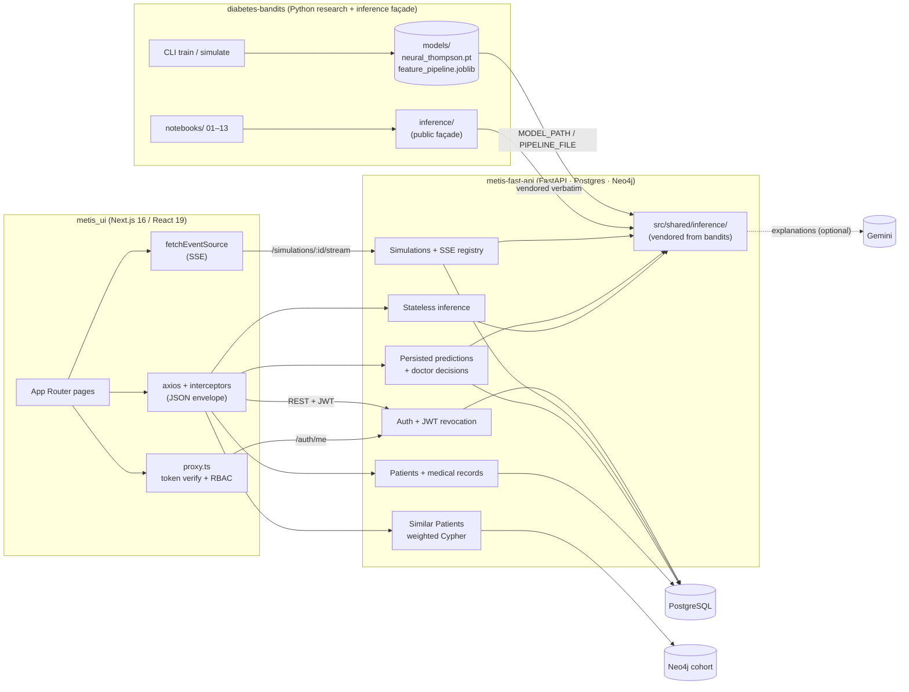
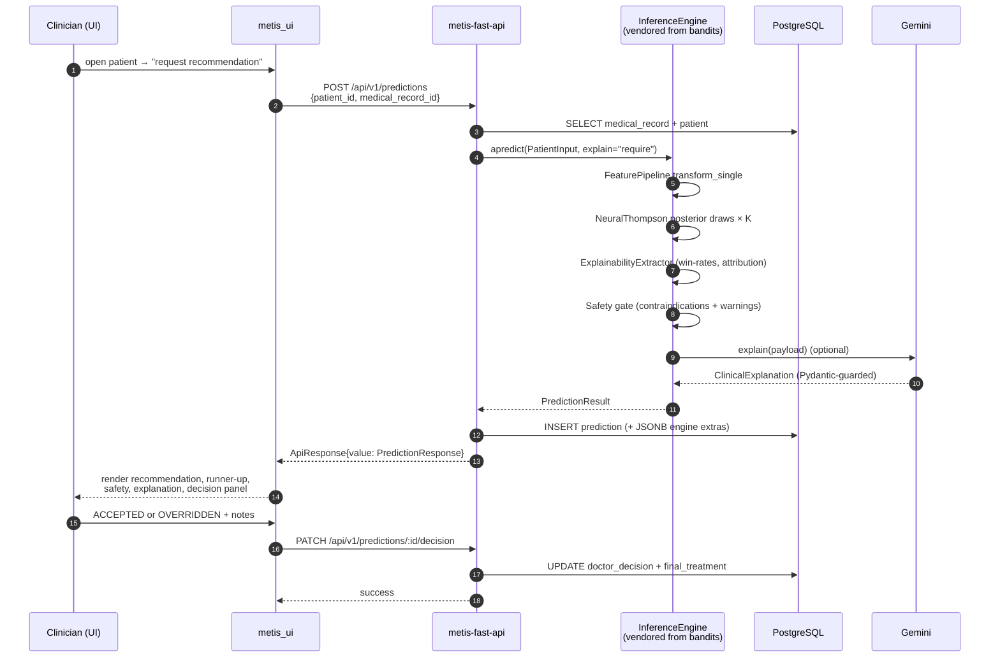
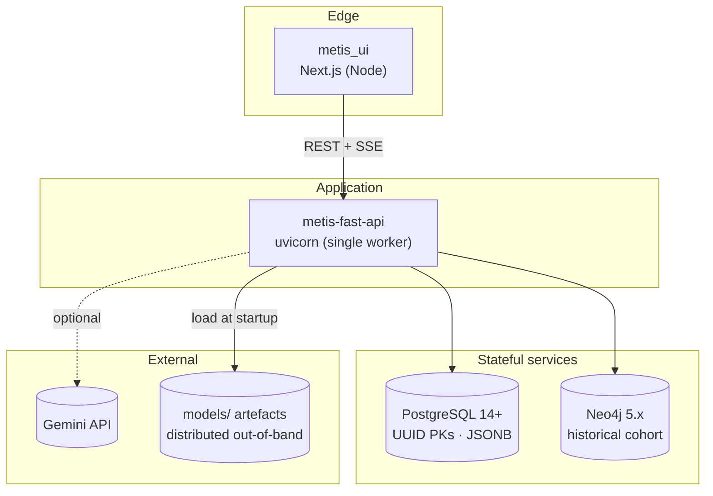

# Metis

> **Personalised Type-2 Diabetes treatment selection — a clinical-decision-support system
> built on a Neural Thompson Sampling contextual bandit.**

Metis is a three-repository system that takes a patient's clinical context (age, BMI, HbA1c,
eGFR, comorbidities, …) and recommends one of five glucose-lowering therapies — **Metformin,
GLP-1 RA, SGLT-2i, DPP-4i, Insulin** — together with a calibrated confidence, a contraindication
check, a runner-up, and (optionally) a Gemini-generated clinical narrative. Clinicians review
the recommendation and record an `ACCEPTED` or `OVERRIDDEN` decision, which is persisted as
training feedback for future iterations. ML-engineer admins can also replay CSV cohorts through
the bandit and watch the posterior evolve live over Server-Sent Events.

This folder is **the meta-repo**: a system-level overview that orients new engineers across
the three working repositories. The components themselves live as siblings on disk:

```
Projects/
├── bandits/             → diabetes-bandits         (ML research + inference façade)
├── fast_api/            → metis-fast-api           (FastAPI backend service)
├── metis_desktop_app/   → metis_ui                 (Next.js desktop client)
└── Metis/               → this folder              (system-level docs)
```

---

## Table of Contents

1. [Why Metis exists](#why-metis-exists)
2. [Who it's for](#who-its-for)
3. [System architecture at a glance](#system-architecture-at-a-glance)
4. [Repository map](#repository-map)
5. [End-to-end data flow](#end-to-end-data-flow)
6. [Wire-contract invariants](#wire-contract-invariants)
7. [Running the whole stack locally](#running-the-whole-stack-locally)
8. [Operational topology](#operational-topology)
9. [Design decisions across the system](#design-decisions-across-the-system)
10. [How to make a change that crosses repos](#how-to-make-a-change-that-crosses-repos)
11. [Related Repositories](#related-repositories)

---

## Why Metis exists

Standard diabetes-management guidelines give *general* rules. The optimal medication for a
*specific* patient is often unclear because dozens of clinical features interact — a 62-year-old
with CKD and a low eGFR has a very different treatment frontier than a 34-year-old with a high
BMI and NAFLD. Treating treatment selection as a **contextual bandit** means the system can:

- **Learn from observational data** — train on a cohort with logged actions, propensities, and
  counterfactual rewards, then exploit known-good policies on new patients.
- **Quantify uncertainty per recommendation** — Thompson sampling gives a posterior distribution
  over each arm's expected reward, which we summarise as a `confidence_pct` and a runner-up so
  clinicians can see how close the call was.
- **Stay safe** — a deterministic safety gate runs *after* the bandit and overrides
  contraindicated arms (Metformin below eGFR 30, SGLT-2 below 25, GLP-1 with MTC/MEN-2 history,
  …). The bandit's pre-override choice is also surfaced for audit.
- **Improve over time** — every doctor decision (`ACCEPTED` / `OVERRIDDEN`) is persisted and
  can be replayed as a `LearningRecord` to update the posterior online via Sherman-Morrison
  rank-1 updates, with periodic backbone fine-tunes from a replay buffer.

Metis is the **complete clinical surface around that core idea**: the model lives in
`diabetes-bandits`, the production HTTP/persistence layer in `metis-fast-api`, and the
clinician + admin UI in `metis_ui`.

---

## Who it's for

| Audience | What Metis gives them |
|---|---|
| **Clinicians (DOCTOR role)** | A patient-centric workflow — manage demographics + medical records, request a recommendation, see calibrated confidence, the runner-up, attribution drivers, safety findings, and a structured Gemini explanation. Record `ACCEPTED` or `OVERRIDDEN` with notes. Search a Neo4j cohort of historical patients to see how similar cases were treated and what happened. |
| **ML-engineer admins (ADMIN role)** | User management plus a CSV-driven bandit simulator: upload 100–50,000 patients, configure ε-decay, optionally reset the posterior, then watch decisions, posterior updates, regret, and treatment counts stream live over SSE — with cancel + reconnect-on-`last_step` semantics. |
| **Researchers** | The `diabetes-bandits` repo is a self-contained research pipeline: synthetic-data generator with counterfactuals, four bandit strategies (greedy / ε-greedy / UCB / Thompson), seven policy classes, offline policy evaluation (IPS / SNIPS / DM / DR with bootstrap CIs), calibration / drift / interpretability tooling, and 12 notebooks that walk through it all. |
| **Engineers integrating the model** | `inference/` in `diabetes-bandits` is a single import surface with no `src/` dependency. It carries its own Pydantic v2 schemas, error hierarchy, streaming session, drift monitor, and (optional) LLM client. The whole package is vendored verbatim into `metis-fast-api/src/shared/inference/`, so production callers and notebook callers run identical code paths. |

---

## System architecture at a glance



The architecture has a **deliberate seam** between the model and the service: `bandits/inference/`
is treated as a frozen third-party library inside `metis-fast-api`, accessed only through
`src/shared/inference_bootstrap.py`. The seam exists so the API can pin a known-good model
artefact + inference surface independently of the research repo's day-to-day churn.

---

## Repository map

| Repo | Tech | What it owns |
|---|---|---|
| **[`diabetes-bandits`](https://github.com/kudzaiprichard/diabetes-bandits)** | Python 3.12, PyTorch 2.8, scikit-learn, XGBoost, Pydantic v2, Typer, JupyterLab | The model (`NeuralThompson` + posterior + replay buffer + drift monitor + IG attribution + safety gate), the feature pipeline, the synthetic-data generator with counterfactuals, offline policy evaluation, training CLI, 12 research notebooks, and the public `inference/` façade with Pydantic schemas, error hierarchy, async/SSE-ready streaming, and an optional Gemini LLM client. |
| **[`metis-fast-api`](https://github.com/kudzaiprichard/metis-fast-api)** | Python 3.11+, FastAPI, SQLAlchemy 2.x async, asyncpg, Alembic, Neo4j 5.x driver, PyJWT, bcrypt, sse-starlette | Authentication (JWT with DB-backed revocation), patient + medical-record CRUD, persisted predictions with doctor decisions, stateless inference, similar-patient retrieval over Neo4j with weighted clinical + Jaccard similarity, and a multi-tenant CSV-driven bandit simulator with an in-memory pub/sub registry + DB replay fallback streamed over Server-Sent Events. |
| **[`metis_ui`](https://github.com/kudzaiprichard/metis_ui)** | Next.js 16 (App Router), React 19, TypeScript strict, TanStack Query v5, axios, `@microsoft/fetch-event-source`, Zod 4, react-hook-form, shadcn/ui + Radix + Tailwind v4, D3 (force / hierarchy), Recharts, PapaParse, Sonner | Two role-scoped surfaces (DOCTOR and ADMIN) routed through the App Router with an `proxy.ts` middleware that verifies the JWT cookie against `/auth/me` and enforces an RBAC allowlist; a strongly typed axios client with a single envelope-aware interceptor pipeline; per-feature TanStack Query hooks; a Neo4j-backed similar-patients graph view with four switchable D3 layouts; and a self-contained bandit-demo page with byte-for-byte CSV pre-validation, SSE consumption, cancel + reconnect-with-`last_step`, and a Recharts metrics rail. |

Each repo's own README is the deep dive — start there once you've read this one.

---

## End-to-end data flow

The canonical clinical journey — from a doctor opening a patient's record to a persisted,
explained recommendation with a doctor decision — looks like this:



The bandit-demo path is structurally similar but streams instead of returning a single result:
the admin uploads a CSV, the API spawns a per-simulation engine and an asyncio task running
`LearningStream.astep` per row, every event is published into an in-memory registry, and the
client subscribes via SSE. Late joiners and reconnects get a paged DB replay (chunks of 500
steps) for any frames that are no longer in the registry's 5,000-event ring buffer. The
simulator owns its **own** `InferenceEngine` per run so its posterior updates do not disturb
the app-wide engine used by `/predictions` and `/inference`.

---

## Wire-contract invariants

These are the "if you change one, you change all of them" constants that bind the three repos:

- **5 treatments, fixed order** — `Metformin · GLP-1 · SGLT-2 · DPP-4 · Insulin`.
  Owned by `inference/_internal/constants.py` in `diabetes-bandits`. The arm index in
  `selected_idx`, `recommended_idx`, `optimal_action`, and the ordered `posterior_means`
  array all reference this list.
- **16 clinical features, fixed order** — `age · bmi · hba1c_baseline · egfr ·
  diabetes_duration · fasting_glucose · c_peptide · cvd · ckd · nafld · hypertension ·
  bp_systolic · ldl · hdl · triglycerides · alt`. The four binary comorbidities travel as
  integers `0`/`1` on every endpoint (except inside the inference module's
  `PredictionResponse.patient` where they are formatted as `"Yes"/"No"` strings for display).
- **`{ success, value, error }` envelope** — every backend response (success or failure) is
  wrapped. `value` and `error` are mutually exclusive. Pagination shape is
  `{ page, total, pageSize, totalPages }`. The UI's axios client unwraps to `T` for callers.
- **camelCase responses, snake_case request bodies** — except for the lone outlier
  `/similar-patients/search/graph`, whose node `data` payloads arrive snake_case and are
  normalised by `normalizeGraphResponse()` in the UI before any component sees them.
- **Machine-readable `error.code` taxonomy** — branch on `error.code`, not HTTP status.
  `INVALID_CREDENTIALS` and `TOKEN_REVOKED` are both 401 but the UI's response is different;
  see `src/lib/constants.ts → ERROR_CODES` for the exhaustive list.
- **Auth: JWTs are revocable.** Every authenticated request hits the `tokens` table to
  re-check revocation, so `logout` and `login` reliably invalidate stolen tokens.

---

## Running the whole stack locally

The three repos run side by side. A typical bring-up:

### 1. Train (or fetch) the model artefacts

```bash
cd diabetes-bandits
conda env create -f environment.yml
conda activate bandits
python -m src.data_generator    # data/bandit_dataset.csv
python -m src.cli train         # models/neural_thompson.pt
                                # models/feature_pipeline_scaled.joblib
```

### 2. Bring up the backend

```bash
cd metis-fast-api
python -m venv venv && venv\Scripts\activate    # or source venv/bin/activate
pip install fastapi uvicorn "sqlalchemy[asyncio]" asyncpg alembic \
            "pydantic[email]" python-dotenv pyyaml pyjwt bcrypt \
            torch numpy pandas joblib scikit-learn loguru \
            google-genai sse-starlette neo4j

# Create .env: DATABASE_URL, JWT_SECRET_KEY, NEO4J_PASSWORD, GEMINI_API_KEY,
# MODEL_PATH=/abs/path/to/diabetes-bandits/models, MODEL_FILE=neural_thompson.pt,
# PIPELINE_FILE=feature_pipeline_scaled.joblib

psql -c "CREATE DATABASE metis;"
alembic upgrade head
python main.py    # http://127.0.0.1:8000  · Swagger /docs · Health /health
```

### 3. Bring up the UI

```bash
cd metis_ui
npm install
npm run dev    # http://localhost:3000 → /login → role-scoped landing page
```

Default admin credentials are seeded on first boot from `security.admin.*` in
`metis-fast-api/src/configs/application.yaml`. The post-login landing page is
`/doctor/patients` for `DOCTOR` and `/ml-engineer/bandit-demo` for `ADMIN`.

---

## Operational topology



**Single-worker constraint.** `metis-fast-api` is currently process-local for two reasons:

1. The `InferenceEngine` posterior is in-memory and serialises updates under a single
   `RLock`. Multi-worker deployments would diverge.
2. The simulation registry (the SSE pub/sub layer) is a process-local dict. Horizontal
   scaling needs a Redis-backed registry to replace it.

For the current scope (research demo + a single-clinic decision-support pilot) the
single-worker constraint is fine; deploying multi-tenant or multi-region is explicitly out
of scope.

---

## Design decisions across the system

These are the decisions worth knowing **before** changing anything:

### 1. The model lives in its own repo and is vendored, not depended on

`bandits/inference/` is copied wholesale into `metis-fast-api/src/shared/inference/`. The
backend never `pip install`s the bandits repo. This is deliberate:

- **Reproducibility** — the API repo carries the exact code that produced the artefacts on
  disk. There is no "did the package version drift?" question.
- **Stability** — research-side changes (new notebooks, new policies, new evaluation
  estimators) cannot break a deployed API. Upgrades are a conscious copy + re-deploy.
- **Auditability** — `engine.snapshot()` returns content-hashed model + pipeline versions,
  visible at `/health`, so it is always provable which artefact is loaded.

The cost is that bumping the model is a deliberate sync step. The benefit is that the
clinical service is never accidentally on a half-merged inference change.

### 2. Continuous learning runs through the same engine, but simulations get their own

`/predictions` and `/inference` share the app-wide `InferenceEngine` so that doctor
decisions can later be replayed as `LearningRecord`s to update the live posterior.
Simulations construct a **per-run engine** and optionally `reset_posterior=True`, so the
admin can stress-test a fresh posterior without disturbing production state.

### 3. JWTs are revocable and every request re-checks the DB

There is no asymmetric-key perf win, but `logout` and `login` reliably invalidate stolen
tokens. The `tokens` table is purged on a background loop. Refresh is silent on
`TOKEN_EXPIRED` only — `INVALID_TOKEN` / `TOKEN_REVOKED` clear cookies and redirect.

### 4. The simulation-stream design is multi-mode by intent

A live SSE subscriber gets in-memory frames; a late joiner falls back to paged DB replay
in chunks of 500 steps; reconnects use `?last_step=N` to resume. The runner batches DB
writes every 100 steps with retries, and on next process boot any `RUNNING` rows whose
process is gone get flipped to `FAILED` so the UI never sees a phantom-running simulation.

### 5. The UI normalises pagination + snake_case at the boundary, never in components

Each `*.api.ts` re-shapes pagination to `{ page, pageSize, total, totalPages }` (camelCase)
before returning. The graph endpoint runs through `normalizeGraphResponse()` to fix four
known wire-contract drifts. Components consume one canonical shape; serialiser drift never
leaks past the boundary.

### 6. Forms are composed from a single Zod source of truth

`src/lib/schemas/fields.ts` owns every clinical field's range + type. The inference form,
the new-medical-record modal, the CSV pre-validator, and the patient form all build from
the same primitives — change a constraint in one place and every form picks it up.

### 7. The safety gate is hard-coded, not learned

Contraindication rules (Metformin below eGFR 30, SGLT-2 below 25, GLP-1 with MTC/MEN-2,
DPP-4 with pancreatitis, type-1 suspicion blocks the lot) live in
`inference/_internal/explainability.py` as deterministic rules. The bandit's pre-override
choice is also surfaced (`model_top_treatment`) so the audit trail shows both the model's
preference and the safety system's correction.

### 8. Drift, attribution, and explanations are best-effort

`explain=True` soft-fails (returns `explanation=None`) so a Gemini outage does not break
the prediction surface. Pass `explain="require"` to force a hard error. Drift alerts ride
along on `LearningAck.drift_alerts` and are intentionally noisy in defaults — production
should tune `BANDITS_DRIFT_THRESHOLD_Z` against a stable baseline.

---

## How to make a change that crosses repos

Most changes touch one repo. A few touch all three. The order matters:

| Change | Order |
|---|---|
| **Model weights / pipeline only** | Train in `diabetes-bandits` → copy `models/*.pt` + `*.joblib` into the path `MODEL_PATH` points at on the API host → restart API. UI needs no change. |
| **New API endpoint** | Add module in `metis-fast-api` (`domain/`, `internal/`, `presentation/`) → register router in `src/core/factory.py` → migration via `alembic revision --autogenerate` if persisted → add `*.api.ts` + hooks in `metis_ui/src/features/<name>/` → update `API_ROUTES` and `ROUTE_PERMISSIONS` if new path prefix. |
| **New error code** | Add to `metis-fast-api`'s `AppException` taxonomy + handler → add to `metis_ui/src/lib/constants.ts → ERROR_CODES` → branch on it in the relevant feature hook. |
| **New clinical feature** (very rare — breaks the wire contract) | Update `inference/_internal/constants.py` in `diabetes-bandits` → re-train → re-vendor `inference/` into the API → migration to widen `medical_records` and `simulation_steps` → update `src/lib/schemas/fields.ts` + `feature-schema.ts` + `csv-validation.ts` in `metis_ui` → bump every `// spec §X` reference. |
| **New treatment** (also very rare) | Same shape as a new feature — `constants.py` is the single source of truth and every consumer indexes into the same ordered list. Re-train, re-vendor, migrate `predictions.recommended_treatment` widening, update the UI's `TREATMENTS` array + chart palette. |

When in doubt: change `diabetes-bandits` first, re-vendor + migrate `metis-fast-api`, then
update `metis_ui` to consume the new shape.

---

## Related Repositories

| Repo | Role | One-line description |
|---|---|---|
| [`diabetes-bandits`](https://github.com/kudzaiprichard/diabetes-bandits) | ML research + inference façade | Neural-Thompson contextual bandit, training CLI, OPE, drift / attribution / safety gate, and the production inference façade vendored into the API |
| [`metis-fast-api`](https://github.com/kudzaiprichard/metis-fast-api) | Backend service | FastAPI clinical workflow — auth, patients, predictions with doctor decisions, similar-cases, multi-tenant bandit simulator with SSE |
| [`metis_ui`](https://github.com/kudzaiprichard/metis_ui) | Desktop client | Next.js 16 / React 19 UI — DOCTOR + ADMIN surfaces over REST and SSE, with a Neo4j similar-patients graph view and a live bandit-demo |
